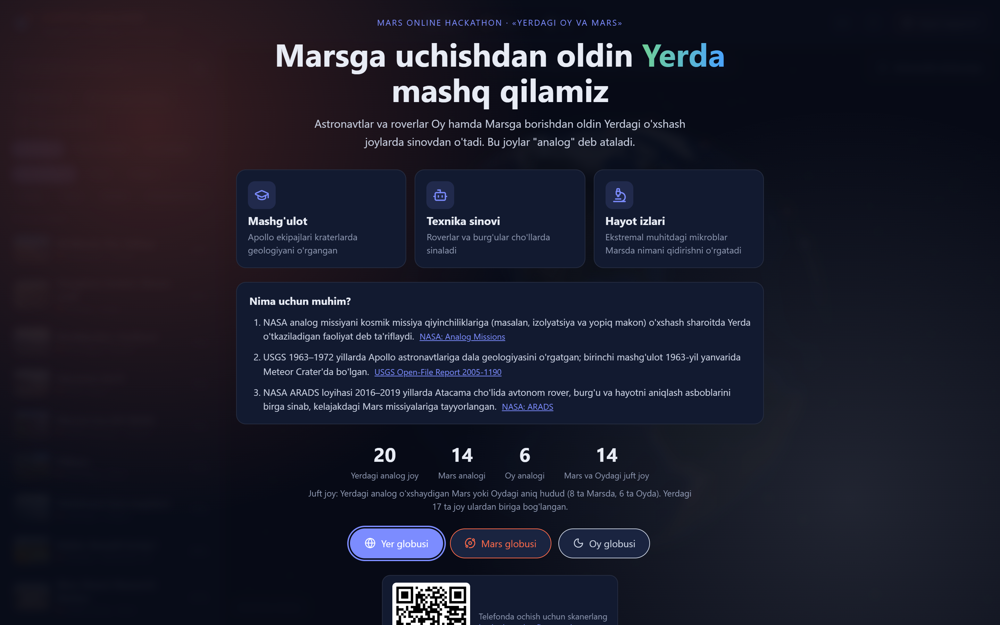
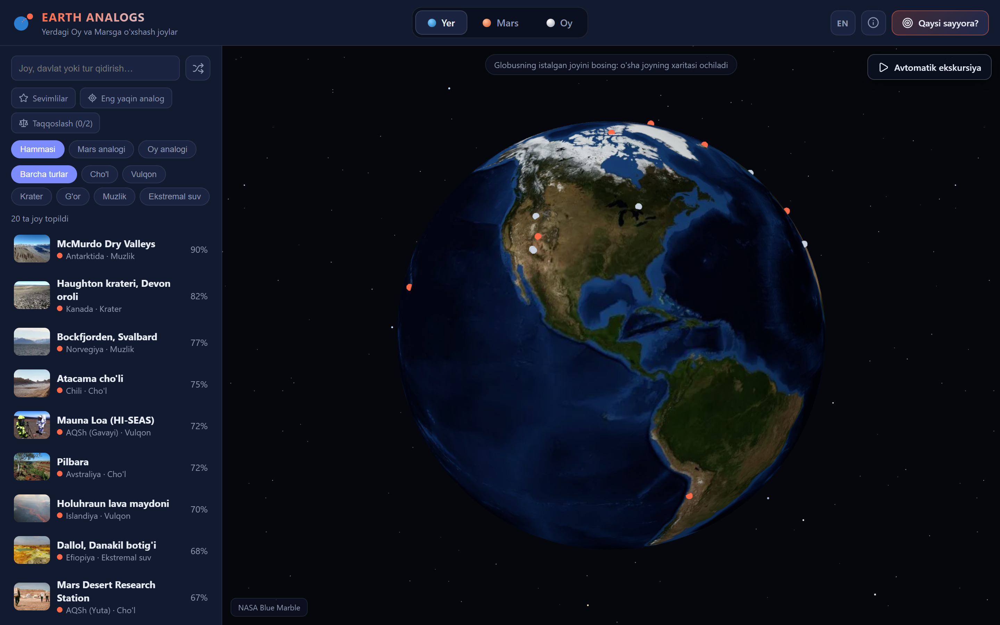
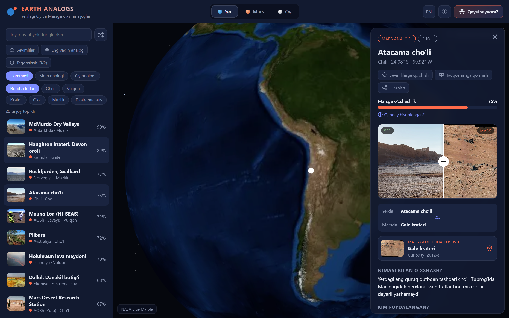
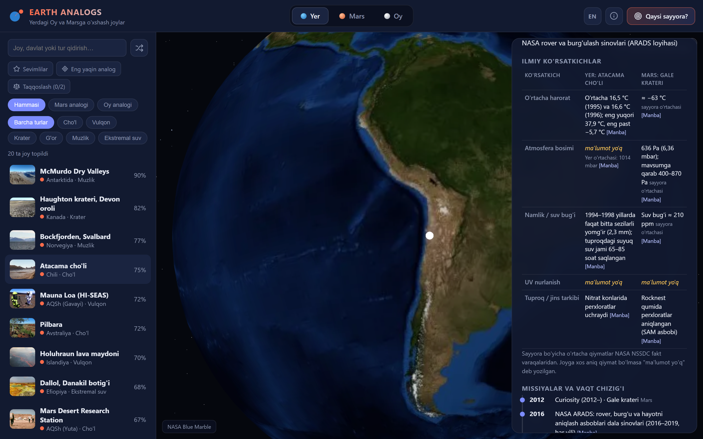
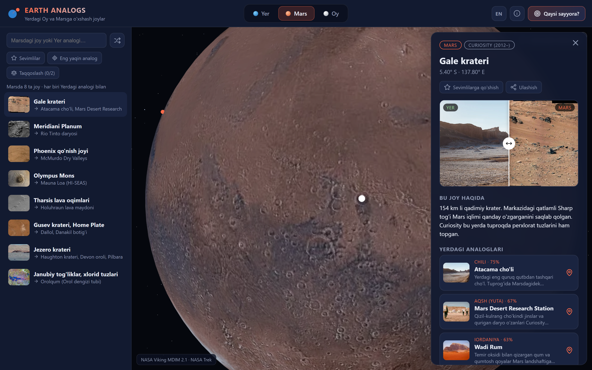
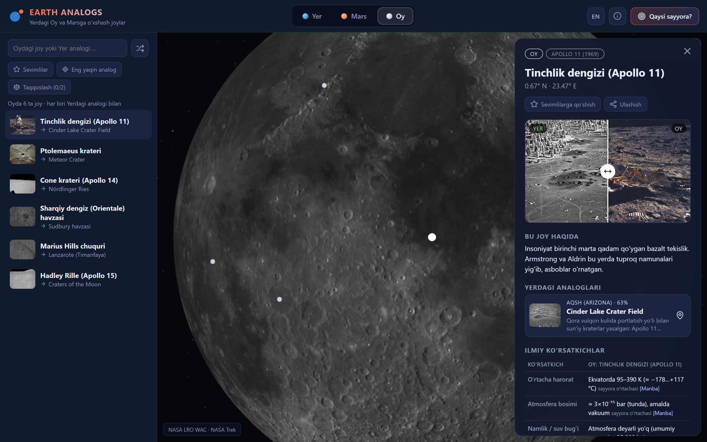
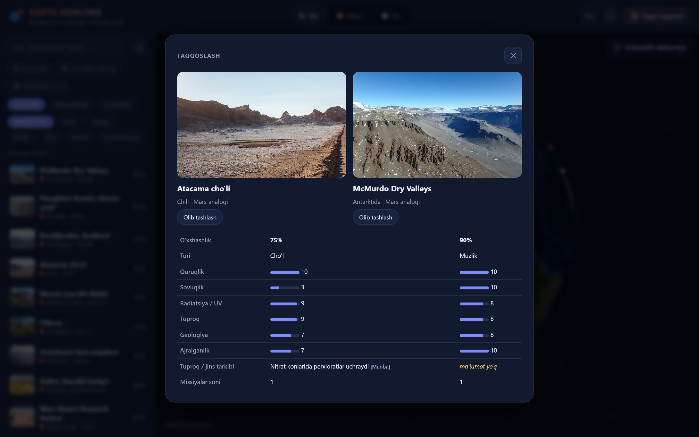
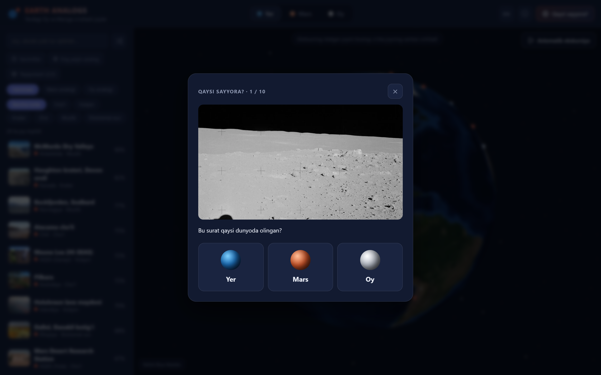
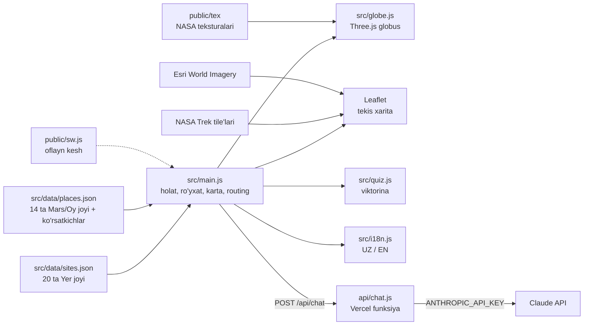

# Earth Analogs Explorer

**Yerdagi Oy va Marsga o'xshash joylarni haqiqiy NASA suratlari, 3D globus va ilmiy ko'rsatkichlar orqali ko'rsatadigan veb-ilova.**
MARS Online Hackathon'ning **«Yerdagi Oy va Mars»** vazifasi uchun tayyorlangan.

- **Sayt:** https://hackathon-rho-flax.vercel.app/
- **Kod:** https://github.com/IsroilIslomov37/hackathon

> **Mustaqil loyiha.** MARS Online Hackathon NASA'ning rasmiy tadbiri emas. Bu loyiha NASA bilan bog'liq emas va NASA tomonidan tasdiqlanmagan. NASA, USGS va boshqa tashkilotlar faqat ochiq ma'lumot manbai sifatida ishlatilgan.

> **English summary.** Earth Analogs Explorer is a web app built for the MARS Online Hackathon (an independent event, not affiliated with NASA). It maps 20 places on Earth that resemble the Moon or Mars and links each one to the specific area on the Moon or Mars it resembles (14 paired places). Users switch between Earth, Mars and Moon globes built from real NASA mosaics, compare photos side by side, read sourced scientific indicators and Apollo-era training timelines, take a quiz, and use the app offline. The interface is in Uzbek and English.

---

## Vazifa

> Yerda Oy va Marsga o'xshash joylarni toping: cho'llar, vulqonlar, g'orlar. Ularni xaritada yoki ilovada ko'rsating va har bir joy Oy yoki Marsga nimasi bilan o'xshashligini tushuntiring.
>
> *MARS Online Hackathon, «Yerdagi Oy va Mars» (qiyin). Format: sayt, interaktiv xarita, ilova.*

## Muammo

Oy yoki Marsga yuboriladigan rover, burg'u, skafandr va ekipajlar avval Yerdagi o'xshash joylarda sinovdan o'tadi. Bunday joylar **analog** deb ataladi. Atacama cho'li yoki Haughton krateri kabi analoglar haqidagi ma'lumotlar turli maqola va sahifalarga sochilib ketgan. Oddiy foydalanuvchi analog nima ekanini, qaysi joy nimasi bilan o'xshashini va u yerda qaysi missiya sinalganini bir joyda ko'ra olmaydi.

## Yechim

Earth Analogs Explorer har bir Yer analogini uning Mars yoki Oydagi aniq jufti bilan bog'laydi va ularni yonma-yon ko'rsatadi:

- **Uchta globus:** Yer (NASA Blue Marble), Mars (Viking MDIM 2.1) va Oy (LRO WAC). Globus bosilganda o'sha joyning tekis xaritasi ochiladi.
- **Juftliklar:** masalan, Atacama ↔ Gale krateri, Rio Tinto ↔ Meridiani Planum, Cinder Lake ↔ Apollo 11 qo'nish joyi. "Juftga uchish" tugmasi globusni boshqa dunyoga olib o'tadi.
- **Haqiqiy suratlar:** har bir joy uchun Yerdagi foto va NASA surati, solishtirish slayderi bilan.
- **Ilmiy ko'rsatkichlar:** harorat, bosim, namlik, UV va tuproq tarkibi, har biri manbasi bilan. Ishonchli manba topilmagan qiymat "ma'lumot yo'q" deb ko'rsatiladi, o'ylab topilmaydi.
- **Missiyalar vaqt chizig'i:** Apollo astronavtlarining dala mashg'ulotlari (USGS hisoboti bo'yicha), HMP, MARTE, AMASE, ARADS, HI-SEAS va boshqalar.
- **Markaziy Osiyo takliflari:** Orolqum, Qizilqum va Ustyurt platosi. Ular rasmiy analog emas, jamoa taklifi sifatida aniq belgilangan.

## Imkoniyatlar

| Imkoniyat | Tavsif |
|---|---|
| Yer / Mars / Oy globusi | Yengil Three.js globus, faqat harakatda chiziladi; tekstura yuklanganda almashadi |
| Tekis xarita | Globus bosilganda Esri yoki NASA Trek xaritasi ochiladi, dunyo takrorlanmaydi |
| Qidiruv va filtrlar | Nom, davlat va tur bo'yicha; `'`, `ʻ`, `’`, katta-kichik harf va diakritika farq qilmaydi |
| Joy kartasi | O'xshashlik foizi va uning izohi, foto slayderi, ko'rsatkichlar jadvali, vaqt chizig'i, mini-xarita, rasm litsenziyalari |
| Taqqoslash | Ikki joyni yonma-yon: foto, mezonlar, tuproq, missiyalar |
| Avtomatik ekskursiya | 60 soniyada joylarni aylanib chiqadi, to'xtatish va davom ettirish mumkin |
| Viktorina | 20 ta matnli va ma'lumotdan yasaladigan rasmli savollar, 4 qiyinlik darajasi, eng yaxshi natija saqlanadi |
| AI yordamchi | Faqat sayt ma'lumotlari asosida javob beradi (`/api/chat`, kalit faqat serverda) |
| Ulashish va havolalar | `#/yer`, `#/mars`, `#/oy`, `#/joy/<id>`; "Ulashish" tugmasi |
| UZ / EN | Til tanlovi saqlanadi |
| Sevimlilar, eng yaqin analog | localStorage va brauzer geolokatsiyasi (ruxsat bilan) |
| Mobil | Pastdan chiqadigan ro'yxat va karta, tugmalar kamida 44 px |
| Oflayn (PWA) | Service worker asosiy fayllar, teksturalar va ko'rilgan rasmlarni keshlaydi |
| Klaviatura va accessibility | O'qlar bilan ro'yxatda yurish, Enter, Esc; modallarda fokus tuzog'i |

## Skrinshotlar

| | |
|---|---|
|  |  |
| Bosh sahifa: "Nima uchun muhim?" va statistika | Yer globusi, 20 ta joy |
|  |  |
| Joy kartasi: Yer ↔ Mars foto slayderi | Ilmiy ko'rsatkichlar, har biri manbasi bilan |
|  |  |
| Mars globusi: Gale krateri va uning Yer analoglari | Oy globusi: Apollo 11 qo'nish joyi |
|  |  |
| Ikki joyni taqqoslash | Rasmli viktorina savoli |

Telefon ko'rinishi: [globus](screenshots/11-mobil-globus.png), [joy kartasi](screenshots/12-mobil-tafsilot.png). Boshqalari: [missiyalar](screenshots/05-missiyalar.png), [tekis xarita](screenshots/08-xarita.png).

## Arxitektura

Backend yo'q: barcha ma'lumot ikki JSON faylda, sayt statik holda Vercel'da turadi. Faqat AI yordamchi uchun bitta serverless funksiya bor.



```
├── index.html              Sahifa, meta va Open Graph teglari
├── src/
│   ├── main.js             Asosiy mantiq: filtrlar, karta, taqqoslash, ekskursiya, routing
│   ├── globe.js            Yengil 3D globus (faqat harakatda chiziladi)
│   ├── quiz.js             "Qaysi sayyora?" viktorinasi
│   ├── i18n.js             UZ / EN matnlar
│   ├── util.js             Qidiruv normalizatsiyasi, localStorage, fokus tuzog'i
│   ├── style.css           Barcha uslublar (qorong'i tema, mobil)
│   └── data/
│       ├── sites.json      Yerdagi analog joylar
│       └── places.json     Mars va Oydagi juftlar, ilmiy ko'rsatkichlar
├── api/chat.js             AI yordamchi (Vercel serverless)
├── public/
│   ├── img/                Fotolar: .jpg, .webp va thumb/ (kichik variant)
│   ├── tex/                Globus teksturalari (2048×1024)
│   ├── sw.js               Service worker
│   ├── manifest.webmanifest, icons/, og.jpg, qr.svg
├── scripts/fetch-images.mjs  Suratlarni NASA / Wikimedia'dan yuklash skripti
└── screenshots/            Taqdimot uchun skrinshotlar
```

## Ma'lumotlar va API'lar

**NASA:**
- [NASA Image and Video Library](https://images.nasa.gov) (`images-api.nasa.gov`): Mars va Oy suratlari (PIA va Apollo raqamlari har bir joy kartasida ko'rsatilgan).
- [NASA Trek](https://trek.nasa.gov) WMTS tile'lari: Mars Viking MDIM 2.1 rangli mozaikasi va Oy LRO WAC global mozaikasi. Globus teksturalari ham shu tile'lardan yig'ilgan.
- NASA Blue Marble: Yer globusi teksturasi.
- [NASA NSSDC fakt varaqalari](https://nssdc.gsfc.nasa.gov/planetary/factsheet/): Yer, Mars va Oyning o'rtacha harorati, bosimi va atmosfera tarkibi.
- [NASA Analog Missions](https://www.nasa.gov/analog-missions/), [ARADS](https://www.nasa.gov/universe/atacama-rover-astrobiology-drilling-studies-arads/), [MARTE](https://www.nasa.gov/centers/ames/research/technology-onepagers/marte.html).

**Boshqa ilmiy manbalar:**
- [USGS Open-File Report 2005-1190](https://pubs.usgs.gov/of/2005/1190/of2005-1190_table1.pdf): Apollo astronavtlarining 1963–1972 yillardagi dala mashg'ulotlari sanalari.
- Maqolalar (DOI orqali tekshirilgan): McKay et al. 2003 (Atacama iqlimi), Doran et al. 2002 (Dry Valleys), Taylor et al. 2010 va Davy et al. 2010 (Phoenix), Klingelhöfer et al. 2004 (Meridiani), Hecht et al. 2009 (perxlorat), Glavin et al. 2013 (Gale), Squyres et al. 2008 (Gusev), Farley et al. 2022 (Jezero), Osterloo et al. 2008 (xloridlar), Fernández-Remolar et al. 2005 (Rio Tinto), Ericksen 1981 (Atacama nitratlari). Har bir qiymat yonidagi **[Manba]** havolasi aniq maqolaga olib boradi.

**Xaritalar va fotolar:**
- Esri World Imagery: Yerning tekis xaritasi va mini-xaritalar.
- Wikimedia Commons: Yerdagi joylarning fotolari. Muallif va litsenziya Commons API'dan olingan va har bir kartada ko'rsatilgan (CC BY, CC BY-SA, FAL, public domain).

**AI:** [Claude API](https://docs.claude.com) (`claude-opus-5-5`): AI yordamchi, faqat `src/data` ichidagi ma'lumotlar asosida javob beradi.

**Kutubxonalar:** Vite 8, Three.js 0.186, Leaflet 1.9, Chart.js 4.5, Lucide 1.51, `@anthropic-ai/sdk` 0.131.

## Ishga tushirish

Node.js 20.19+ yoki 22.12+ kerak (Vite 8 talabi).

```bash
npm install
npm run dev
```

Sayt `http://localhost:5173` da ochiladi. Production build va uni lokal ko'rish:

```bash
npm run build
npm run preview
```

Vercel'ga deploy:

```bash
npx vercel deploy --prod --yes
```

**Muhit o'zgaruvchilari (Vercel → Settings → Environment Variables):**

| Nom | Majburiymi | Vazifasi |
|---|---|---|
| `ANTHROPIC_API_KEY` | Yo'q | AI yordamchi uchun. Bo'lmasa chat tugmasi ko'rinmaydi, qolgan hammasi ishlaydi |

Vercel Web Analytics ishlashi uchun loyiha sozlamalarida **Analytics** yoqilgan bo'lishi kerak. AI yordamchi va Analytics faqat Vercel'da ishlaydi, `npm run dev` da ular o'chiq turadi.

## Yangi joy qo'shish

1. `src/data/sites.json` ga yangi obyekt qo'shing (mavjud yozuvdan nusxa oling):

```json
{
  "id": "yangi-joy",
  "name": "Joy nomi",
  "country": "Davlat",
  "coords": [41.3, 69.2],
  "analog": "mars",
  "type": "desert",
  "proposed": true,
  "spaceMatch": "Marsdagi o'xshash relyef",
  "params": { "aridity": 8, "cold": 4, "radiation": 6, "regolith": 7, "geology": 6, "isolation": 7 },
  "why": "Nimasi bilan o'xshashligi",
  "usedBy": "Kim foydalangan",
  "wiki": "https://en.wikipedia.org/wiki/...",
  "place": "gale",
  "missions": [{ "year": 2020, "uz": "Missiya", "en": "Mission", "src": { "label": "Manba", "url": "https://..." } }],
  "credits": { "earth": { "text": "Wikimedia Commons", "url": "https://...", "artist": "Muallif", "license": "CC BY-SA 4.0" }, "space": null },
  "en": { "name": "Place name", "country": "Country", "spaceMatch": "...", "why": "...", "usedBy": "..." }
}
```

- `analog`: `mars` yoki `moon`. `type`: `desert`, `volcano`, `crater`, `cave`, `ice`, `water`.
- `params` (0–10) jamoa bahosi; noma'lum bo'lsa `null` qo'ying, joy "baholanmagan" deb ko'rsatiladi.
- `place`: `places.json` dagi juftning `id` si, jufti yo'q bo'lsa `null`.
- Rasm yo'q bo'lsa `"photo": false` qo'ying, placeholder chiqadi.

2. Fotoni `public/img/<id>-earth.jpg` nomi bilan qo'ying (Mars yoki Oy surati: `<id>-space.jpg`). WebP va kichik variant ixtiyoriy: ular bo'lmasa sayt avtomatik JPG'ni oladi.

3. Mars yoki Oydagi yangi juft kerak bo'lsa, `src/data/places.json` ga xuddi shu tuzilishda yozuv qo'shing. Ko'rsatkichlar `metrics.body` (Mars/Oy) va `metrics.earth.<site-id>` (Yer) ichida turadi; har bir qiymatga `src` (manba nomi va havolasi) yozing.

4. Teksturalar yoki asosiy fayllar o'zgarsa, `public/sw.js` dagi `VERSION` ni oshiring, aks holda eski kesh qolishi mumkin.

## To'ldirilishi kerak bo'lgan ma'lumotlar

Ishonchli manba topilmagan qiymatlar saytda **"ma'lumot yo'q"** deb ko'rsatiladi. Ularni manbasi bilan `src/data/places.json` ga yozish kerak:

**Mars va Oy tomoni (`metrics.body`):**
- **UV nurlanish:** barcha 14 ta joyda yo'q.
- **Tuproq tarkibi:** Olympus Mons, Tharsis, Ptolemaeus, Orientale, Marius Hills.
- **Harorat, bosim, namlik:** Phoenix'dan tashqari hamma joyda hozircha NASA'ning sayyora bo'yicha o'rtachasi turibdi. Joyga xos o'lchovlar (masalan, Curiosity REMS, Perseverance MEDA) bilan almashtirish mumkin.

**Yer tomoni (`metrics.earth`):**
- **Atacama:** bosim, UV.
- **McMurdo Dry Valleys:** bosim, namlik, UV, tuproq.
- **Rio Tinto:** harorat, bosim, namlik, UV.
- **Qolgan 14 ta joy** (MDRS, Wadi Rum, Mauna Loa, Holuhraun, Dallol, Haughton, Pilbara, Orolqum, Cinder Lake, Meteor Crater, Ries, Sudbury, Lanzarote, Craters of the Moon): barcha 5 ko'rsatkich.

**Boshqa:**
- Missiyalar yili va manbasi yo'q: Dry Valleys (Viking davri), Holuhraun (NASA SAND-E), Dallol (Europlanet), Lanzarote (ESA PANGAEA).
- Qizilqum va Ustyurt: foto, o'xshashlik baholari (`params`) va Mars/Oydagi juft.
- Svalbard: suratdagi ALH84001 meteoritining Marsdagi aniq joyi noma'lum, shuning uchun jufti yo'q.

## Cheklovlar

- **O'xshashlik foizi** 6 ta mezon bo'yicha jamoa bergan baholarning o'rtachasi. Bu ilmiy o'lchov emas, taqqoslash uchun soddalashtirilgan ko'rsatkich (saytda "Qanday hisoblangan?" oynasida izohlangan).
- **Taxminiy hududlar:** Tharsis va janubiy tog'liklardagi xloridlar uchun nuqta hudud markazida turibdi.
- **Orolqum, Qizilqum, Ustyurt** rasmiy analog emas, jamoa taklifi.

## Jamoa

| Ism | Rol | Aloqa |
|---|---|---|
| TODO | Dasturchi | TODO |
| TODO | Taqdimotchi | TODO |
| TODO | TODO | TODO |

## Telefonda ochish


https://hackathon-rho-flax.vercel.app/

## Litsenziya

- **Kod:** TODO (masalan, MIT; jamoa tanlashi kerak).
- **Fotolar** o'z mualliflarining litsenziyasi ostida, har biri saytdagi joy kartasida ko'rsatilgan. NASA suratlari public domain.
